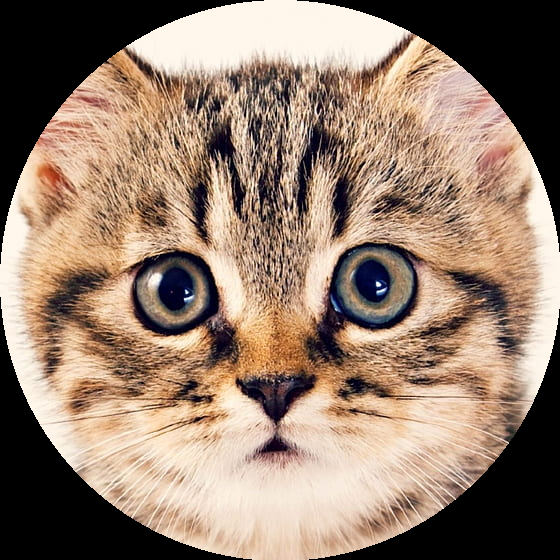
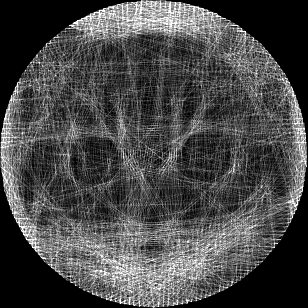
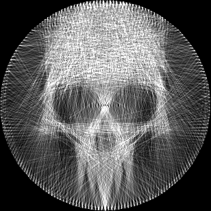
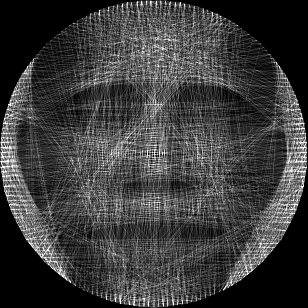

Collaborators: Maythas Wangcharoenwong 6480265, Nathan Sakchiraphong 6480142
# String-Art-Generator \[Numerical Computations Project]
-------------------
## Overview
The code provided in StringArt_Notebook.ipynb utilizes a greedy algorithm to create the image and uses multi-threading to increase the performance of the program. The String Art Generator also employs the use of an algorithm that generalises Bresenham's line algorithm to update the intermediate points. The output image largely depends on the parameters, so please experiment to get the best results. For the implementation details, please check out the notebook. 

## Dependencies
- numpy
- opencv
- matplotlib
- pillow

## Sample Output Images

### \[1] Sample Cat Image

    Original Image: 
    &emsp; &emsp; &emsp; &emsp; &emsp; &emsp; &emsp; &emsp; &emsp; &emsp; &emsp; &ensp; 
    String Art: 

    
    &nbsp; &nbsp; &nbsp; &nbsp;
    

### \[2] Sample Skull Image

    Original Image: 
    &emsp; &emsp; &emsp; &emsp; &emsp; &emsp; &emsp; &emsp; &emsp; &emsp; &emsp; &ensp; 
    String Art: 

    
    &nbsp; &nbsp; &nbsp; &nbsp;
    

### \[3] Sample Obama Image

    Original Image: 
    &emsp; &emsp; &emsp; &emsp; &emsp; &emsp; &emsp; &emsp; &emsp; &emsp; &emsp; &ensp; 
    String Art: 

    
    &nbsp; &nbsp; &nbsp; &nbsp;
    

